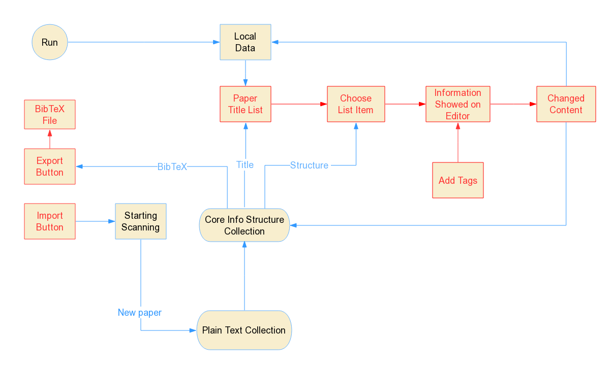
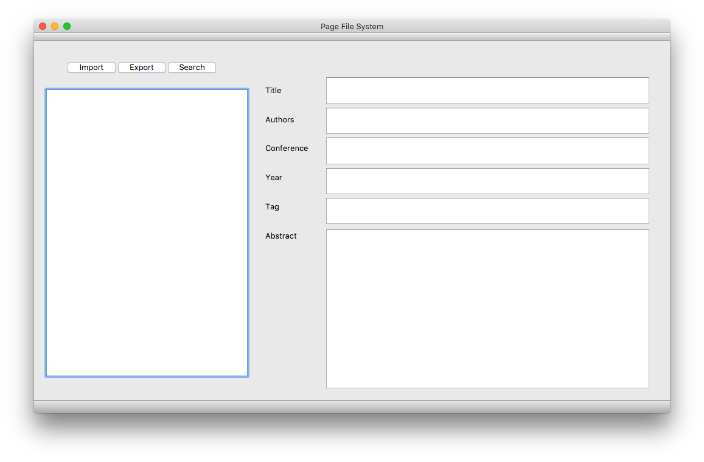
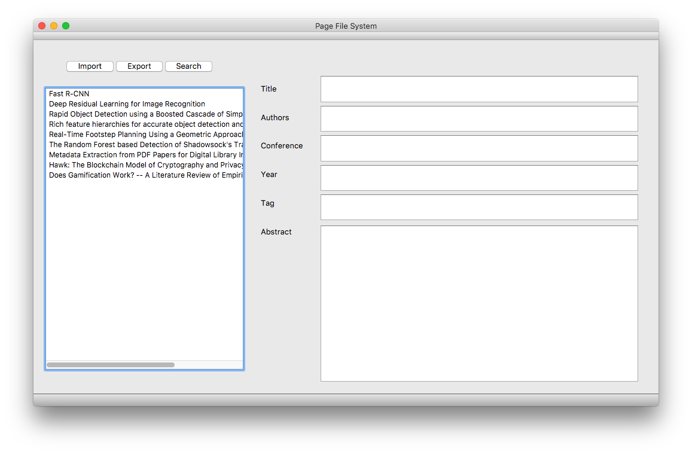
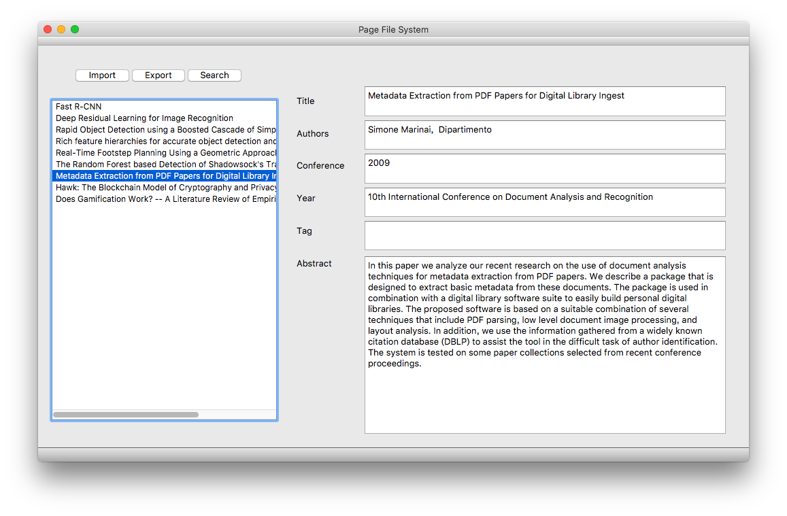
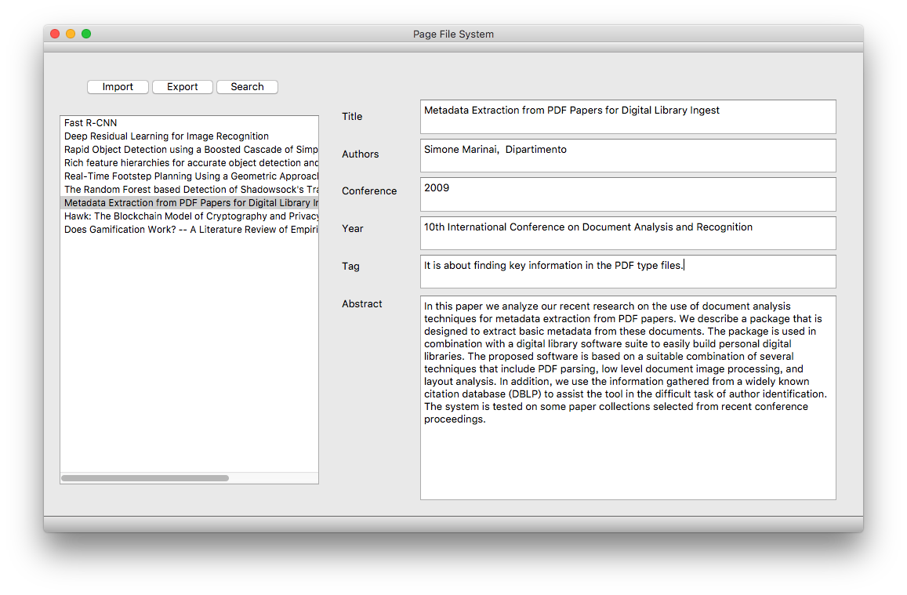
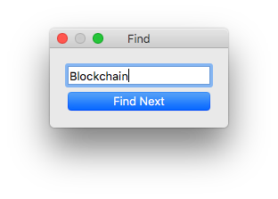
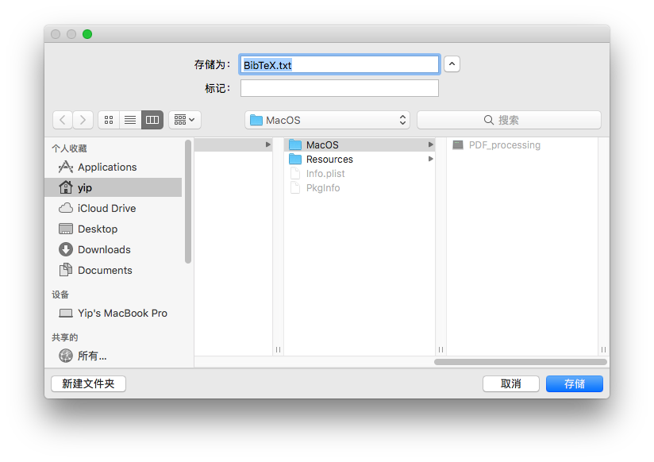
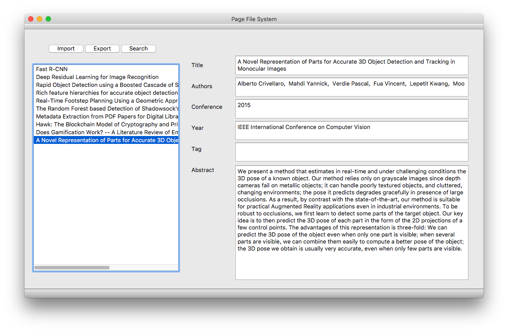

# Paper File System

Ye Shuqian 115010269, Chen Yu 115010124

## Background

Reading papers is a common task for all researchers. Hundreds of papers are always annoying to arrange. Researchers have to take a lot of time to classify papers. However, it is still sometimes cannot find out the paper they want. This is a waste of time for scientific research. A well designed paper file system can increase work efficiency.

Now, most programs that realized paper management using Javascript, which can provided an easy way to connect to the API provided by the papers database, so they need Internet connection. A typically example is Zotero. There is almost no similar project written in C++. So we give a solution of paper file system application based on C++.

## Introduction

This project realize a software that can arrange IEEE conference papers and export the BibTeX references. The software read papers in subfolder `data` in the build folder .  User needs to click `Import` button, the software will grasp out the core information in the papers and show them on the interface.  Clients also can edit the information manually, and the data will save to the data files locally which can be used automatically next time run th program.  The `Export` button can used to output the reference of papers into a txt file in the format of BibTeX to custom path. Also a basic search function is provided to find specific string in the titles.

## Implementation

The interface read the structure then show  them up at labeled text editor. Clients can copy or edit them easily.  The interface based on QT GUI, which  offer a easy and straight way to build the GUI.  

The flowchart of our project is below.

In the process of software realization there are two main difficulties. 

1. Authors’ name are irregular as names are in different languages, Italics, Chinese pinyin are hard to recognize directly. A exterior neural network program called is used to solve it.
2. In the design of GUI, although QT offer the engineers a quick access, the QT style Signal and Slot interaction need take extra work to learn the logic and syntax.

##### Read data:

The function `findInfo()` calls a complied pdstotxt function in Xpdf library by calling system command to converts pdf files into txt files so that the content can be read into C++ steam.  When user click the `Import` button the background read these information to recognize title, authors, conference, keywords, DOI, published year and abstract then package them into a C++ struct called `paper`,  and all papers storaged in a  `vector<paper>`. In function `finAuthor()` which recognition of authors, we call the Named Entity Recognizer in Stanford CoreNLP Natural Language Processing Toolkit by calling system command, and detect the output file to find out the authors. Function `copyToDestdir` is implement in the `.pro` file to move the files from the folder code in to the build folder for PDF data reading 

##### Export reference:

The function `MainWindow::saveAs()` use `QFileDialog`  provided by Qt to choose the saved path. And then it calls function `MainWindow::saveFile()` to save the string into text file. The string is created by function `exportBibTeX()` following the format of BibTeX. 

##### Main GUI window:
The structure of interface was built by QT designer. The signal and slot was realized by code in `mainwindow.cpp`

##### Search:
The search function match the keywords with all the paper titles by visiting the pointer's content. The mathed pointer are save in a vector of pointer. Each time users click the `Next` button, the interface will highlight the mateched paper.

##### Data storage and read:

The function `saveToFile()` will save all the data into files based on string type, when finishing data detecting and the program terminated. The function `readFromFile()` will try to read data from saved files if the data files existed when the program is started. If the data is loaded, the program will only analysing the PDFs which are not in the list but in the `pdf` folder.

## Result

##### Demo

When run the program first time, the GUI window is like belowing.

Now user should put the PDF papers into the subfolder `pdf` in building folder, then click `Import` button and wait a few seconds. After the analyzing, the information is showed on the interface as below.

Click an paper in the list widget at the left part of the window, the paper metadata will show in the right part automatically.

The user can change or copy the text in the textbooks freely. There may be some metadata cannot be detected or dected with some mistakes, users should correct them manually. All the changes will be saved in real time.

User can click `search ` botton to search the data in the PDF title. A dialog will pop. There is a text editor on dialog to type keywords for searching. And the main window will hightlight the item in the left list, click the highlighted item, it's metadata will shown. Also user can click `Find Next` to search next item contains the keywords.

Users can export the reference of all papers into BibTeX format by clicking `Export` in main window. A window will show for selecting path for saving and setting file name. The BibTex file will generate at the specified path.

Next time open the program, the data still shows on the interface. If users need to add paper, put the PDF file into data folder as before, then click `Import` button. The new papers will be added at the paper list.

## Division & Contrubution

Chen Yu mainly contributed the GUI window, search function, and connected between GUI widget data. Ye Shuqian mainly contributed the PDF reading, reference export, and data read/store. Two member share the same contribution.

## Conclusion

In this project, a lite paper arragment program was implement. The program is baed on C++ and no need to connect to the internet. The core infomation is processed automatically at background, but clients can also edit manually. This project can be used to manage paper reference and export easily.

The techinques of pointer, struct and class, file stream, system command calling, and QT designer interface were used, also git tool is used during the team collaboratation. From the project, we have learned how to manage code using `git` , how to design a simple GUI using Qt, how to read file and path, how to call system command, and be more familiar with pointer and object, have some basic idea of compiling process.

In furture, the functions of searching at the scope of all data, showing more information on interface and supporting more kinds of paper formats could be added into project. 

## Reference

Manning, Christopher D., Mihai Surdeanu, John Bauer, Jenny Finkel, Steven J. Bethard, and David McClosky. 2014. [The Stanford CoreNLP Natural Language Processing Toolkit](http://nlp.stanford.edu/pubs/StanfordCoreNlp2014.pdf) In *Proceedings of the 52nd Annual Meeting of the Association for Computational Linguistics: System Demonstrations*, pp. 55-60.